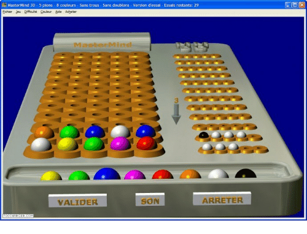
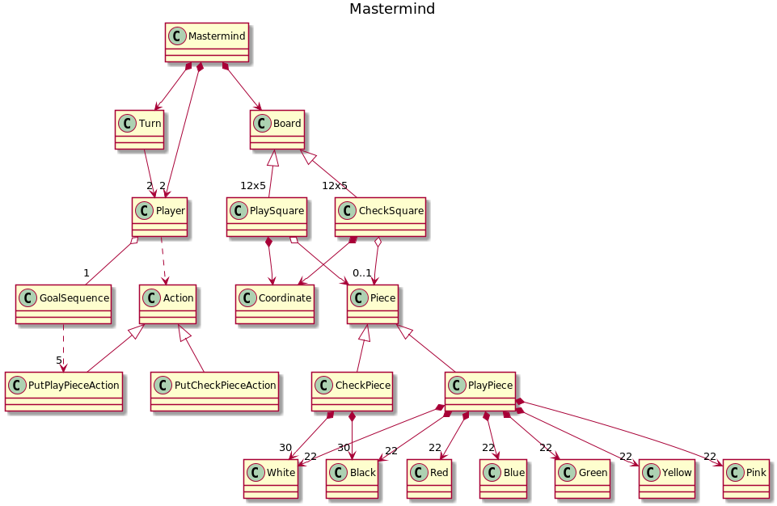

# MASTERMIND 

Explicación del [mastermind](https://www.youtube.com/watch?v=sL5sf318GHY&t=291s)

El mastermind en el que yo me he basado para hacer esta rama inicial, difería del que hemos usado posteriormente para las ramas *domainModel* y *documentView*
Varía en
* Número de combinaciones
* Número de bolas de cada color
* No existe distinción física entre bola e indicador de acierto (son unas bolas de color blanco y otras de color negro)

## Modelo del dominio

 
 
 ### Diagrama de clases
 
 
 

