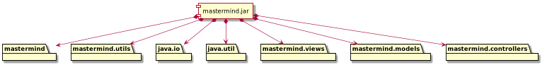

# MASTERMIND.  DOMAIN MODEL

Autor: Jaime Hernández Ortiz
Email: jaime.hernandezortiz@gmail.com
Version 0.0.1-SNAPSHOT

## Indice
   * Requisitos 
   * Modelo del dominio
   * Vista Lógica/Diseño
        * Arquitectura
        * Paquetes
   * Calidad del software
   * Vista de desarrollo/implementación
   * Vista de despliegue
   * Vista de procesos

### Requisitos
 
  
 
 [Wiki](https://en.wikipedia.org/wiki/Mastermind_(board_game)) - [Youtube](https://www.youtube.com/watch?v=2-hTeg2M6GQ)
 
 * Funcionalidad: *Básica*
 * Interfaz: texto
 * Distribución: standalone
 * Persistencia: no
---------------------------------------------------
### Modelo del dominio
 
  

---------------------------------------------------  
### Vista lógica/diseño

Aplicación del Modelo del Dominio mediante Estrategias de Análisis Formal, Análisis Clásico, Experto del Dominio, Reparto de Responsabilidades.
 
#### Arquitectura

#### Paquetes

--------------------------------------------------
### Calidad del Software
#### Diseño
    * *Método largo*: Método "play" de MastermindGameLauncher...

#### Rediseño
    * *Nueva interfaz*: Gráfica    
    * *Clases Grandes*: los Modelos asumen la responsabilidad y crecen en líneas, métodos y atributos con cada nueva tecnología
    * *Alto acoplamiento*: los Modelos con cada nueva tecnología de interfaz (consola, gráficos, web)
    * *Baja cohesión*: cada Modelo está gestionando sus atributos y las tecnologías de interfaz
    * *Open/Close*: hay que modificar los modelos que estaban funcionando previamente para escoger una tecnología de vista u otra (if’s anidados)
---------------------------------------------------
### Vista de Desarrollo/Implantación
    

---------------------------------------------------
### Vista de Despliegue/Física

---------------------------------------------------
### Vista de Procesos
* No hay concurrencia